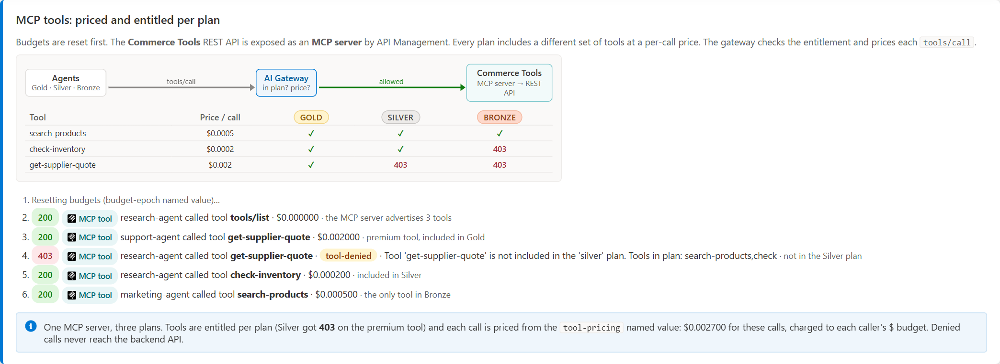
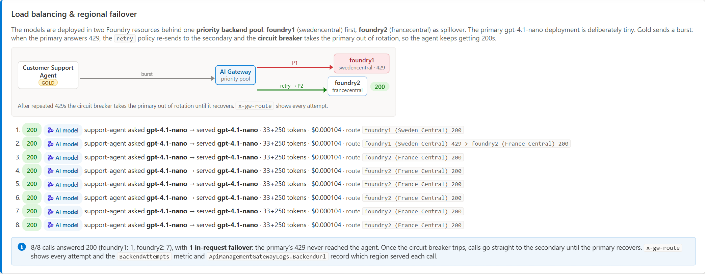
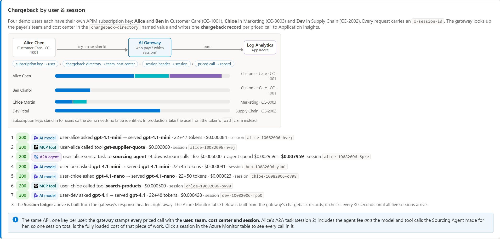
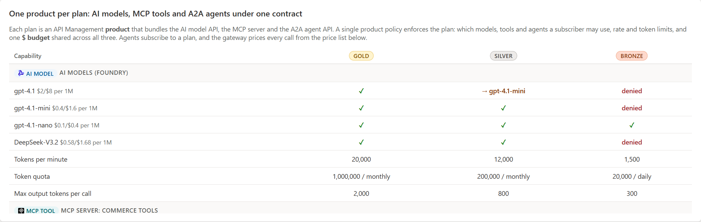
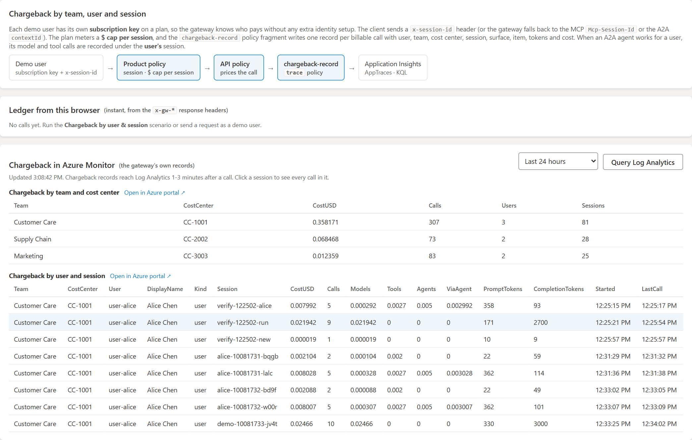
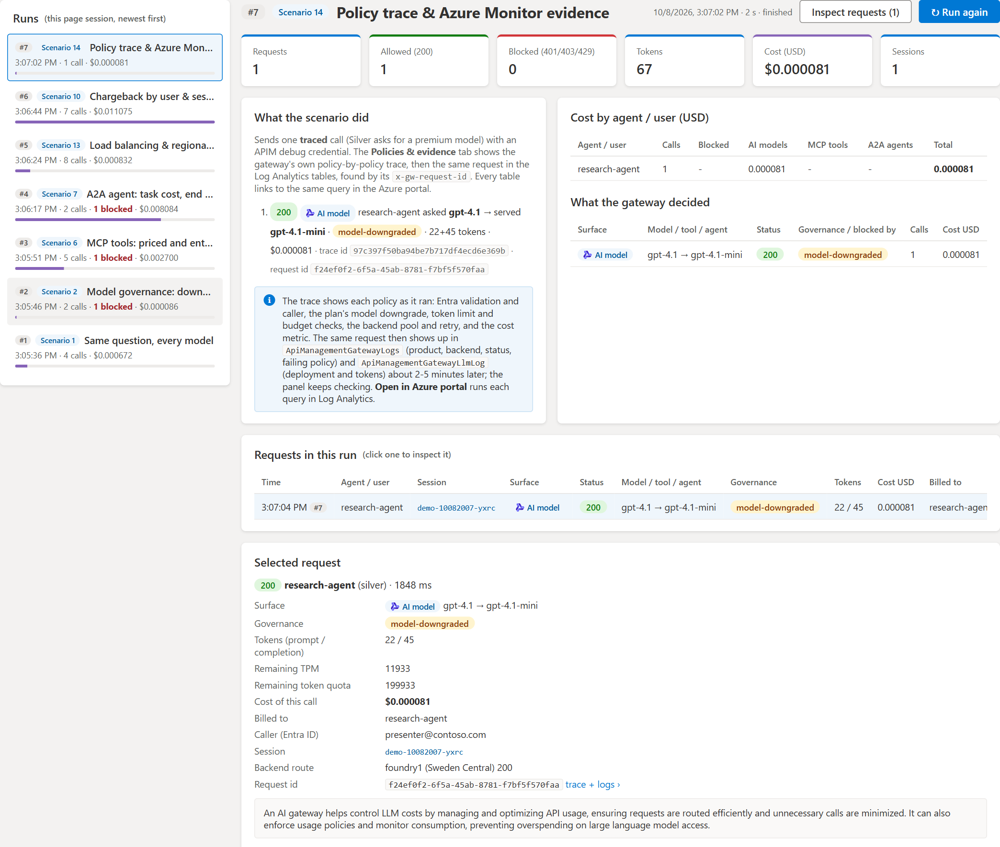
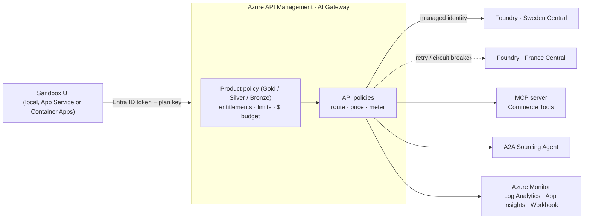

<!-- markdownlint-disable MD033 -->

<div align="center">

# 🧪 AI Gateway Sandbox

**An interactive demo of the AI Gateway pattern: govern, meter and charge back AI models, MCP tools and A2A agents through Azure API Management.**

[](https://github.com/Azure-Samples/AI-Gateway)
[](https://learn.microsoft.com/azure/api-management/genai-gateway-capabilities)
[](https://learn.microsoft.com/azure/ai-foundry/)
[](#-quick-start)

</div>

> [!NOTE]
> **This repository is a fork of [Azure-Samples/AI-Gateway](https://github.com/Azure-Samples/AI-Gateway).**
> Upstream is a library of 30+ single-topic labs. This fork packages those building blocks (Bicep modules, APIM policies, MCP servers, shared utilities) into **one end-to-end, clickable demo**: the [AI Gateway Sandbox](labs/ai-gateway-sandbox/). It deploys a realistic gateway and gives you a web UI that drives real traffic through it, so you can watch every policy decision and every cent of cost as it happens. The upstream labs are still here, unchanged. See [What else is in this repo](#-what-else-is-in-this-repo).

<p align="center">
  
  <br/><sub><i>The Sandbox UI. Pick one of 14 guided scenarios, or click <b>Run the full demo</b> (about 85 real calls, under $0.10, about 9 minutes).</i></sub>
</p>

## 🎯 What you get

One deployment turns Azure API Management into an **AI Gateway** in front of three kinds of AI resources, and gives you a UI that exercises them:

| Surface | Behind the gateway | What the gateway does |
|---|---|---|
| 🧠 **AI models** | `gpt-4.1`, `gpt-4.1-mini`, `gpt-4.1-nano`, `DeepSeek-V3.2` in two Microsoft Foundry regions | Entitles models per plan (allow, downgrade or deny), caps output, limits tokens per minute, enforces quotas, balances load and fails over between regions |
| 🔧 **MCP tools** | A REST "Commerce Tools" API exposed as an **MCP server** by APIM | Entitles each tool per plan and prices every `tools/call` |
| 🤖 **A2A agents** | A Sourcing Agent reachable over the **A2A protocol** | Charges a per-task fee **plus** every model and tool call the agent makes, all billed to the original caller |

Every consumer subscribes to a **Gold, Silver or Bronze plan** (one APIM product each) with **one $ budget shared across models, tools and agents**. Every call is authenticated with **Microsoft Entra ID**, priced by the gateway, and recorded in **Azure Monitor** for chargeback by team, user and session.

## 🎓 What you'll learn

By the end of the demo you will have seen, with real calls and real logs:

- **Identity:** how `validate-azure-ad-token` in a policy fragment provides zero-trust access, and how the gateway records *who* called separately from *which plan pays*.
- **Plans as products:** how one APIM product policy enforces model, tool and agent entitlements, token limits and a single $ budget.
- **Cost governance:** what it costs to send the same prompt to different models (up to ~20× apart), and how downgrades, output caps, TPM limits and $ budgets stop overspend *before* tokens are spent.
- **Tools and agents economics:** how to price MCP tool calls and A2A tasks, and how to roll an agent's downstream spend back up to the caller.
- **FinOps chargeback:** how to attribute every cent to a team, cost center, user and session, including per-session $ caps for runaway sessions.
- **Resilience:** how a priority backend pool with retry and a circuit breaker turns a regional 429 into a 200.
- **Evidence:** how to prove each decision with response headers, the APIM policy trace, Log Analytics tables and Application Insights.

## 🖼️ A tour of the app

All screenshots below are from the real app running against a live deployment.

### Guided scenarios explain themselves

Each scenario sends a small, fixed number of real calls, draws the path it took (consumer → gateway → model, tool or agent) and ends with a one-line takeaway.

**Same question, every model.** One prompt to each model and the price of each call. The spread is the business case for model governance.


**Model governance: downgrade or deny.** Silver asks for `gpt-4.1` and is silently downgraded to `gpt-4.1-mini`. Bronze is denied with 403, and Foundry is never called.


**MCP tools, priced and entitled per plan.** One MCP server, three plans. Silver gets `tool-denied` on the premium tool, and every allowed call is priced.



**A2A agent task cost, end to end.** The agent fee plus every downstream model and tool call is billed to the caller who sent the task.


**Load balancing & regional failover.** Sweden Central returns 429, the gateway retries in France Central, and the circuit breaker keeps the agent on 200s.



**Chargeback by user & session.** Four users, one key each, named sessions. Alice's A2A session includes the agent's downstream spend.



<details>
<summary><b>All 14 scenarios</b></summary>

| # | Scenario | What you see |
|---|----------|--------------|
| 1 | Same question, every model | Gold asks one question on each model and the gateway prices each call. |
| 2 | Model governance: downgrade or deny | Silver is downgraded to `gpt-4.1-mini`. Bronze gets 403 and nothing reaches Foundry. |
| 3 | Output cap | Bronze asks for `max_tokens: 4000` and the gateway caps it at 300. |
| 4 | Tokens-per-minute limit | Bronze bursts and gets 429 with `Retry-After` after 1,500 tokens per minute. |
| 5 | $ budget exhausted | Silver spends its $0.01 budget and gets 403. |
| 6 | MCP tools: priced and entitled per plan | Tools are allowed or denied per plan, and each call is priced. |
| 7 | A2A agent: task cost, end to end | Agent fee plus downstream calls, billed to the caller. Bronze gets `agent-denied`. |
| 8 | One $ budget across models, tools and agents | Silver mixes surfaces until the shared budget returns 403. |
| 9 | Chargeback in Azure Monitor | Cost per consumer, plan, surface and resource from Application Insights. |
| 10 | Chargeback by user & session | Cost by team, cost center, user and session, with drill-down. |
| 11 | Runaway session: per-session $ cap | One session hits its $0.02 cap. A new session still works. |
| 12 | Zero trust: Microsoft Entra ID | No token returns 401. With a token, `x-gw-caller` shows who called. |
| 13 | Load balancing & regional failover | A 429 in the primary region is retried in the secondary. |
| 14 | Policy trace & Azure Monitor evidence | The policy-by-policy trace, then the same request in Log Analytics. |

</details>

### Live session: every call, priced and attributed

KPIs, the last response (served model, governance action, tokens, cost, who pays, who called, which region), $ budget burn per consumer, cost by surface and a request log for the whole session.


### Products & plans: one contract for models, tools and agents

Each plan is an APIM product that bundles the model API, the MCP server and the A2A agent API, with its entitlements, limits and price list.



### Policies & evidence: watch a call flow through the gateway

Pick any request and it replays in an animated diagram from its `x-gw-*` response headers: the plan and API policy scopes, the backend pool, managed identity, the Foundry regions and the Azure Monitor sinks. Beside it are the response headers and the APIM trace that confirms which policies ran. Canned examples cover the happy path, a downgrade, a 429, a 403 budget, a regional failover, an MCP call, an A2A task and a 401.


### Chargeback by team, user and session

A live ledger from the response headers, then the gateway's own `chargeback-record` traces in Application Insights, rolled up by team and cost center and drillable to every call in a session.



### Azure Monitor: the same story from the logs

Cost by agent, surface and time, who pays for what and via which path (direct or through an agent), tokens by model, and governance actions, all queried live from Application Insights. A deployed Azure Monitor **Workbook** shows the same data in the portal.


### Run history: replay and inspect any run

Every scenario run is kept for the page session with its KPIs, what the gateway decided, and the exact HTTP requests it made. **Inspect requests** shows the method, URL, headers, body and **Copy as curl**, with secrets masked.



## 🏗️ Architecture



The full design (policies, fragments, pricing, metrics and logs) is documented in the [lab README](labs/ai-gateway-sandbox/README.md).

## 🚀 Quick start

**Prerequisites:** an Azure subscription with Contributor and RBAC Administrator (or Owner) rights, the [Azure CLI](https://learn.microsoft.com/cli/azure/install-azure-cli), and Python 3.12+ with [uv](https://docs.astral.sh/uv/). The `azd` path also needs the [Azure Developer CLI](https://learn.microsoft.com/azure/developer/azure-developer-cli/install-azd).

### Option 1: one command with `azd` (recommended)

Deploys the gateway, Foundry, MCP server, A2A agent and monitoring, and hosts the UI on **Azure Container Apps behind Microsoft Entra ID sign-in**:

```bash
git clone https://github.com/JinLee794/AI-Gateway-Sandbox.git
cd AI-Gateway-Sandbox/labs/ai-gateway-sandbox
azd auth login
azd up      # pick an environment name, subscription and region (e.g. swedencentral)
```

`azd up` takes about 10 minutes and prints the UI URL (`SERVICE_UI_URI`). Edit [`sandbox-config.json`](labs/ai-gateway-sandbox/sandbox-config.json) first to change regions, models, prices, plans or consumers. Use `azd deploy` to ship UI changes only, and `azd down --purge` to remove everything.

### Option 2: step by step in the notebook

```bash
git clone https://github.com/JinLee794/AI-Gateway-Sandbox.git
cd AI-Gateway-Sandbox
uv sync
code labs/ai-gateway-sandbox/ai-gateway-sandbox.ipynb
```

The notebook explains and deploys each piece in turn, then writes the UI configuration. Set `host_demo_ui = True` in its first cell to also host the UI on App Service behind Easy Auth.

### Option 3: run the UI locally

After a notebook deployment, the UI is a single Python file with no dependencies. It uses your Azure CLI login:

```bash
python labs/ai-gateway-sandbox/src/app.py --port 8080
# open http://localhost:8080
```

> [!TIP]
> Start with **Reset budgets**, then **Run the full demo**. Calls are real and billed, but the whole demo costs well under $0.10 at the demo prices. The UI server also refuses more than 60 gateway calls per minute as a safety net.

Clean up with the [clean-up notebook](labs/ai-gateway-sandbox/clean-up-resources.ipynb) or `azd down --purge`.

## 📦 What's packaged

| Path | What it is |
|---|---|
| [`labs/ai-gateway-sandbox/`](labs/ai-gateway-sandbox/) | **The Sandbox.** Notebook, `azure.yaml` + `infra/` for `azd`, `main.bicep`, APIM policies and fragments (`product-policy.xml`, `policy.xml`, `entra-identity-fragment.xml`, `chargeback-fragment.xml`, `attribution-fragment.xml`), the Azure Monitor `workbook.json`, and the UI in `src/` |
| [`modules/`](modules/) | Reusable Bicep modules from upstream: APIM, Foundry / Cognitive Services, Log Analytics, Monitor, networking |
| [`shared/`](shared/) | Python helpers (`utils.py`, `apimtools.py`), notebook snippets and sample MCP servers |
| [`tools/`](tools/) | Standalone notebooks for tracing, streaming, rate-limit testing, OAuth and a mock OpenAI server |
| [`labs/`](labs/) | All the upstream single-topic labs, unchanged |

## 📚 What else is in this repo

Everything from upstream [Azure-Samples/AI-Gateway](https://github.com/Azure-Samples/AI-Gateway) is still here. If you want to go deeper on one capability the Sandbox shows, these labs isolate it:

| Sandbox capability | Go deeper with |
|---|---|
| Load balancing & failover | [Backend Pool Load Balancing](labs/backend-pool-load-balancing/backend-pool-load-balancing.ipynb) |
| Token limits & quotas | [Token Rate Limiting](labs/token-rate-limiting/token-rate-limiting.ipynb) |
| $ budgets & FinOps | [FinOps Framework](labs/finops-framework/finops-framework.ipynb) |
| Model routing | [Model Routing](labs/model-routing/model-routing.ipynb) |
| MCP tools | [Model Context Protocol](labs/model-context-protocol/model-context-protocol.ipynb), [MCP from API](labs/mcp-from-api/) |
| A2A agents | [A2A Enabled Agents](labs/mcp-a2a-agents/mcp-agent-as-a2a-server.ipynb) |
| Identity | [Access Controlling](labs/access-controlling/) |
| Metrics & logs | [Token Metrics Emitting](labs/token-metrics-emitting/), [Built-in Logging](labs/built-in-logging/) |

Browse the full upstream catalog at **[aka.ms/ai-gateway/labs](http://aka.ms/ai-gateway/labs)**. The repo also ships Copilot Agent Skills (`lab-creator`, `apim-bicep`, `apim-terraform`, `apim-policies`, `apim-kql`, `mcp-builder`) for building your own labs with AI.

## 📖 Resources

- 📘 [AI Gateway capabilities in Azure API Management](https://learn.microsoft.com/azure/api-management/genai-gateway-capabilities)
- 📕 [Enterprise AI Gateway e-Book](docs/media/Enterprise%20AI%20Gateway%20eBook%20-%20Feb%202026.pdf)
- 🎓 [AI Gateway Workshop](https://aka.ms/ai-gateway/workshop)
- 🧭 [Upstream: Azure-Samples/AI-Gateway](https://github.com/Azure-Samples/AI-Gateway)
- 🏛️ [Foundry Citadel](https://aka.ms/foundry-citadel)

## 🤝 Contributing

Issues and pull requests for the Sandbox are welcome here. For the upstream labs, please contribute to [Azure-Samples/AI-Gateway](https://github.com/Azure-Samples/AI-Gateway) (see [CONTRIBUTING.md](CONTRIBUTING.MD)).

## License

[MIT](LICENSE.md). This fork keeps the upstream license.
