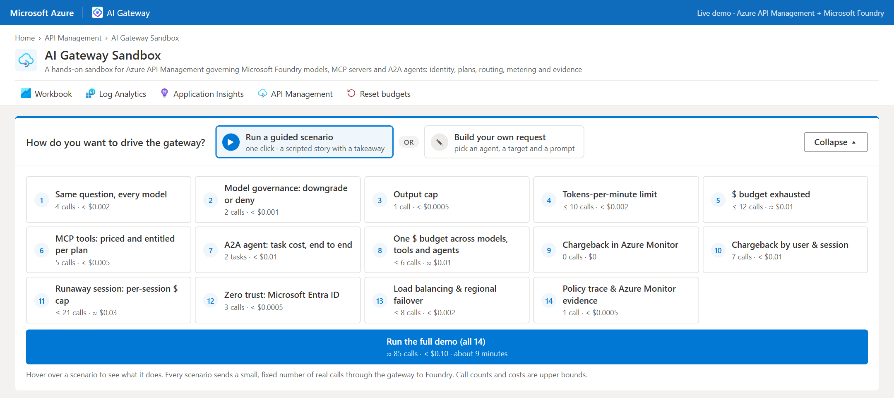
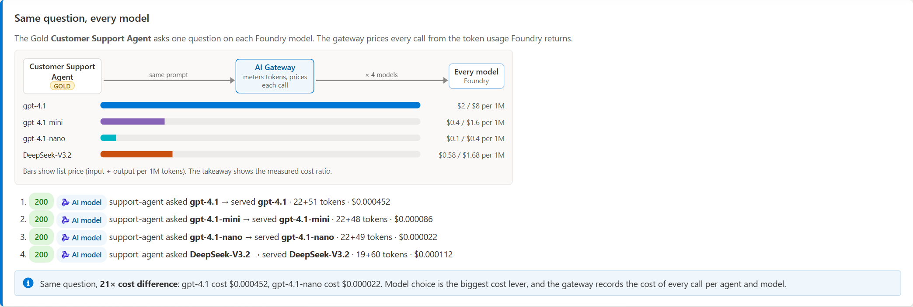
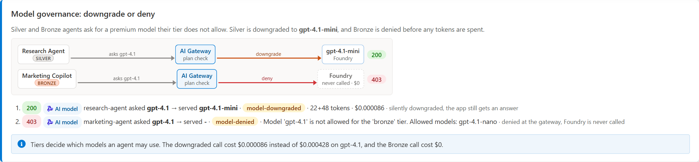
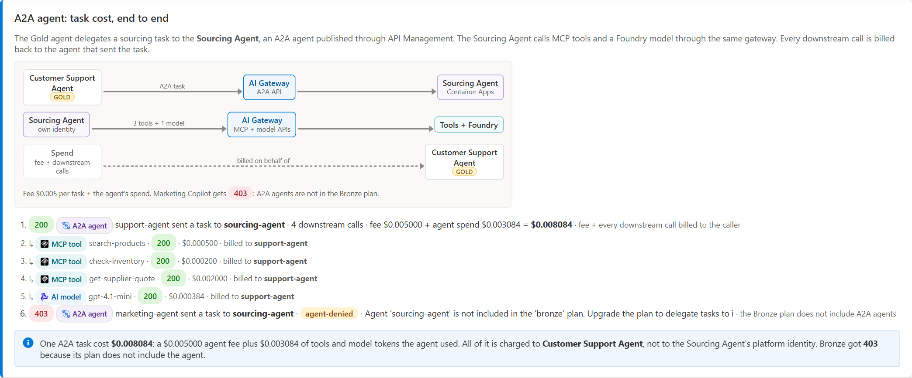
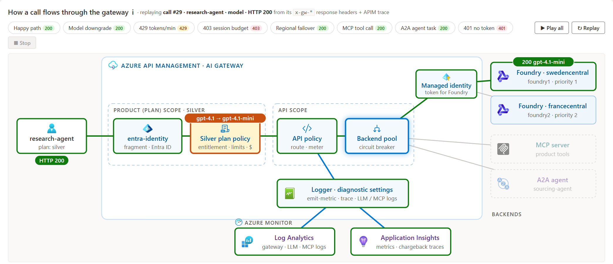
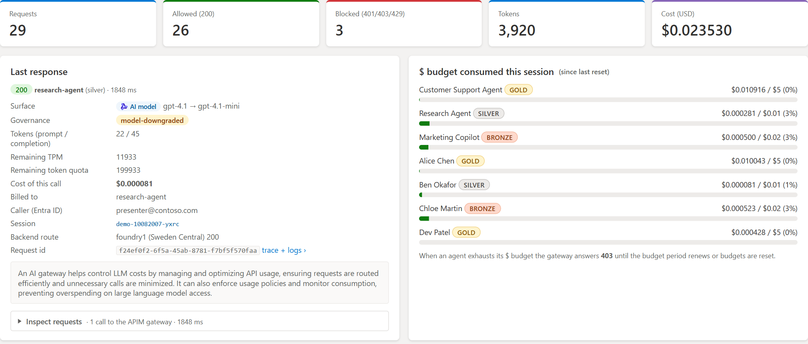
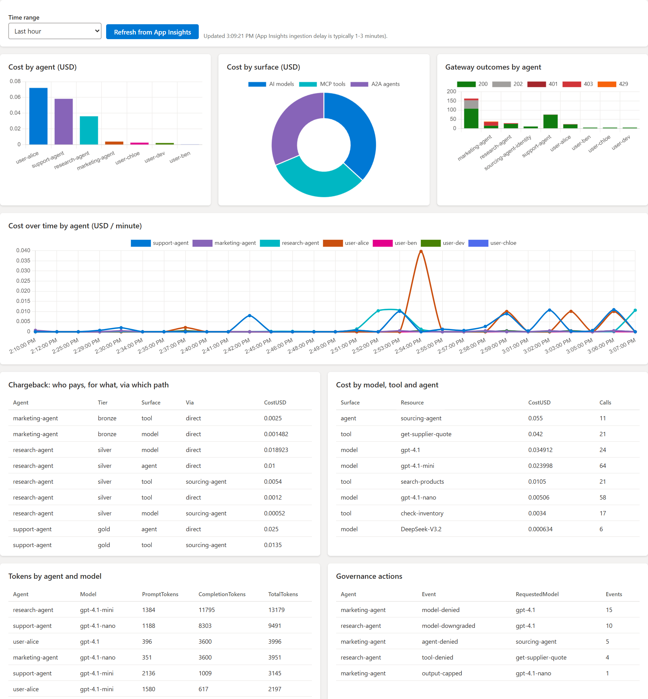
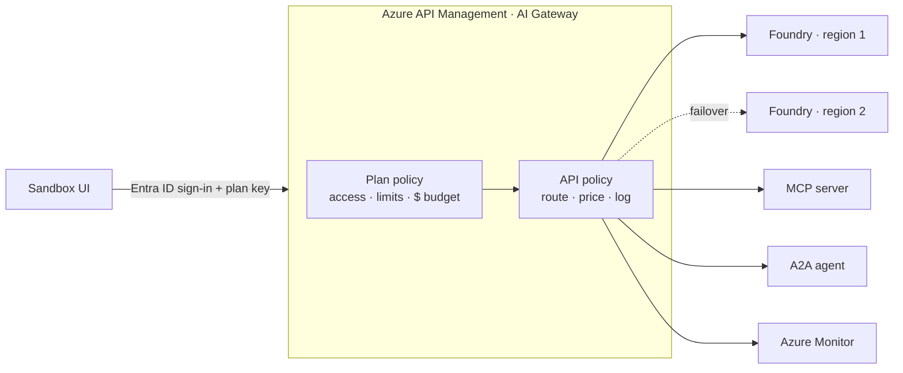

<!-- markdownlint-disable MD033 -->

<div align="center">

# 🧪 AI Gateway Sandbox

**A clickable demo of Azure API Management as an AI Gateway for models, MCP tools and A2A agents.**

[](#-deploy-it-yourself)
[](https://codespaces.new/JinLee794/AI-Gateway-Sandbox)
[](https://github.com/Azure-Samples/AI-Gateway)

</div>

> [!NOTE]
> This is a fork of [Azure-Samples/AI-Gateway](https://github.com/Azure-Samples/AI-Gateway). It packages the upstream building blocks into one demo you can deploy with `azd up` and drive from a web UI. The upstream labs are still here, unchanged.

<p align="center">
  
</p>

Pick a scenario, and the Sandbox sends real calls through the gateway. You see what the gateway allowed, blocked or rerouted, what each call cost, and who pays for it.

## 🚀 Deploy it yourself

You need an Azure subscription where you are **Owner** (or Contributor + RBAC Administrator), the [Azure Developer CLI](https://learn.microsoft.com/azure/developer/azure-developer-cli/install-azd) and Python 3.12+.

```bash
git clone https://github.com/JinLee794/AI-Gateway-Sandbox.git
cd AI-Gateway-Sandbox
azd auth login
azd up
```

That's it. `azd up` asks for an environment name, a subscription and a region (for example `swedencentral`), and takes about 10 minutes. When it's done, open the printed `SERVICE_UI_URI` and sign in with your Microsoft Entra ID account.

> [!TIP]
> **No local tools?** Click **Open in Codespaces** above. It comes with `azd`, the Azure CLI and Python ready. Run `azd auth login --use-device-code`, then `azd up`.

**When you're done**, remove everything with `azd down --purge`.

<details>
<summary><b>More deployment options</b></summary>

- **Change the setup:** edit [`sandbox-config.json`](labs/ai-gateway-sandbox/sandbox-config.json) before `azd up` to change regions, models, prices, plans or users.
- **Share the UI:** only the person who ran `azd up` can sign in. To add others, assign them to the *AI Gateway Sandbox UI (&lt;environment&gt;)* enterprise app in Microsoft Entra ID.
- **Ship UI changes only:** `azd deploy`.
- **Tenant needs a service tree ID on app registrations:** run `azd env set AZURE_SERVICE_MANAGEMENT_REFERENCE <id>` before `azd up`.
- **Step by step instead:** run `uv sync`, then open the [notebook](labs/ai-gateway-sandbox/ai-gateway-sandbox.ipynb). It deploys one piece at a time and explains each one.
- **Run the UI on your machine:** after a notebook deployment, run `python labs/ai-gateway-sandbox/src/app.py --port 8080` and open <http://localhost:8080>.

Full details are in the [lab README](labs/ai-gateway-sandbox/README.md#-get-started).

</details>

## 🎯 What's in the demo

One deployment puts API Management in front of three things:

- 🧠 **AI models:** `gpt-4.1`, `gpt-4.1-mini`, `gpt-4.1-nano` and `DeepSeek-V3.2` in Microsoft Foundry, in two regions.
- 🔧 **MCP tools:** a REST API that API Management turns into an MCP server.
- 🤖 **A2A agent:** a Sourcing Agent that calls tools and models of its own.

Each user is on a **Gold, Silver or Bronze plan** with one $ budget for all three. Every call is signed in with **Microsoft Entra ID**, priced by the gateway and logged to **Azure Monitor**.

## 🎓 What you'll learn

- **Control costs:** the same prompt can cost about 20× more on one model than another. See how the gateway downgrades, caps or blocks calls before money is spent.
- **Sell plans:** how one API Management product per plan controls which models, tools and agents a user gets.
- **Price tools and agents:** how to charge for MCP tool calls and A2A tasks, including what an agent spends on your behalf.
- **Charge back:** how to report cost by team, user and session.
- **Stay up:** how the gateway retries in a second region when the first one is busy.
- **Prove it:** how to trace each decision in headers, the API Management trace and the logs.

## 🖼️ A quick tour

**Same question, every model.** One prompt, four models, four prices.



**Downgrade or deny.** Silver asks for `gpt-4.1` and gets `gpt-4.1-mini`. Bronze is blocked, and the model is never called.



**Agent costs, end to end.** The agent's fee plus every tool and model call it makes are billed to the user who asked.



**Watch a call move through the gateway.** Replay any call as an animated diagram, from sign-in to plan policy to backend to logs.



**See every call priced.** Cost, tokens, who called, who pays, and how much budget each user has left.



**Same story in Azure Monitor.** Cost by user and by surface, and what the gateway did, queried from Application Insights.



<details>
<summary><b>All 14 scenarios</b></summary>

| # | Scenario | What you see |
|---|----------|--------------|
| 1 | Same question, every model | One question on each model, each call priced. |
| 2 | Model governance: downgrade or deny | Silver gets a cheaper model. Bronze gets 403. |
| 3 | Output cap | Bronze asks for 4,000 tokens and gets 300. |
| 4 | Tokens-per-minute limit | Bronze goes over its limit and gets 429. |
| 5 | $ budget exhausted | Silver spends its budget and gets 403. |
| 6 | MCP tools: priced and entitled per plan | Tools are allowed or denied per plan, and priced. |
| 7 | A2A agent: task cost, end to end | Agent fee plus its calls, billed to the caller. |
| 8 | One $ budget across models, tools and agents | Mixed calls until the shared budget runs out. |
| 9 | Chargeback in Azure Monitor | Cost per user, plan and surface from the logs. |
| 10 | Chargeback by user & session | Cost by team, user and session. |
| 11 | Runaway session: per-session $ cap | One session is stopped. A new one still works. |
| 12 | Zero trust: Microsoft Entra ID | No token gets 401. With one, you see who called. |
| 13 | Load balancing & regional failover | A busy region is retried in the other one. |
| 14 | Policy trace & Azure Monitor evidence | The policy trace, then the same call in the logs. |

The full demo is about 85 calls and costs less than $0.10.

</details>

## 🏗️ How it fits together



The [lab README](labs/ai-gateway-sandbox/README.md) explains every policy, price and log.

## 🗺️ Roadmap: what's not in the Sandbox yet

The upstream labs already show each of these patterns on their own. The Sandbox doesn't include them yet. 🚧 = in progress, 💡 = idea.

**Scenarios**

| Status | Scenario | What it would show | Builds on |
|---|---|---|---|
| 💡 | Cache hits cost $0 | Repeated questions are answered from a semantic cache, and chargeback shows the savings. | [semantic-caching](labs/semantic-caching/) |
| 🚧 | Blocked before spend | Unsafe prompts and sensitive data are stopped at the gateway, so no tokens are spent on them. | [content-safety](labs/content-safety/), [apim-purview-dlp](labs/apim-purview-dlp/) |
| 💡 | Is the cheaper model good enough? | Cost compared with quality, using stored prompts and Foundry evaluations. | [message-storing](labs/message-storing/), [foundry-models-evals](labs/foundry-models-evals/) |
| 💡 | GitHub Copilot chargeback | Copilot BYOK traffic goes through the gateway and is billed per developer. | [ghcp-byok-foundry](labs/ghcp-byok-foundry/) |
| 💡 | Foundry agents and Toolbox | Agents hosted in Foundry and Foundry Toolbox tools are billed back to the team that calls them. | [ai-foundry-model-gateway](labs/ai-foundry-model-gateway/), [ai-foundry-toolbox](labs/ai-foundry-toolbox/) |
| ✅ | Over budget, switched off | An Azure Monitor alert and a Logic App suspend a subscription that goes over its budget. | [finops-framework](labs/finops-framework/) |
| 🚧 | Real users, not keys | Chargeback by Entra ID user, instead of one subscription key per user. | [access-controlling](labs/access-controlling/), [mcp-client-authorization](labs/mcp-client-authorization/) |
| 💡 | One budget across clouds | Amazon Bedrock and Google Gemini models share the same plans and price list. | [aws-bedrock](labs/aws-bedrock/), [google-gemini-api](labs/google-gemini-api/) |
| 💡 | Self-hosted showback | Self-hosted models are priced per GPU-second instead of per token. | [serverless-gpu](labs/serverless-gpu/), [self-hosted-ollama](labs/self-hosted-ollama/) |
| 🚧 | Pricing beyond tokens | Charges per image, for audio tokens and for stateful Responses API calls. | [image-generation](labs/image-generation/), [realtime-audio](labs/realtime-audio/), [secure-responses-api](labs/secure-responses-api/) |

**Ways to deploy**

| Status | Deployment | Why | Builds on |
|---|---|---|---|
| 💡 | AI Gateway tier (preview) | Runs the Sandbox on the new SKU built for AI models and MCP servers. | [aigw-foundry-models](labs/aigw-foundry-models/), [`modules/ai-gateway`](modules/ai-gateway/) |
| 💡 | Private networking | StandardV2 with private endpoints to Foundry, for regulated customers. | [private-connectivity](labs/private-connectivity/), [foundry-e2e-private](labs/foundry-e2e-private/) |
| 💡 | Terraform | Deploys the same resources as `azd up`, for teams that use Terraform. | [backend-pool-load-balancing-tf](labs/backend-pool-load-balancing-tf/) |
| 💡 | Hybrid / on-premises | The self-hosted gateway applies the same token governance outside Azure. | [slm-self-hosting](labs/slm-self-hosting/) |

## 📦 What's in this repo

| Path | What it is |
|---|---|
| [`labs/ai-gateway-sandbox/`](labs/ai-gateway-sandbox/) | **The Sandbox:** infrastructure, policies, notebook and UI |
| [`modules/`](modules/), [`shared/`](shared/), [`tools/`](tools/) | Bicep modules, Python helpers and test tools from upstream |
| [`labs/`](labs/) | All 30+ upstream labs, unchanged |

Want to go deeper on one topic? Try [load balancing](labs/backend-pool-load-balancing/backend-pool-load-balancing.ipynb), [token limits](labs/token-rate-limiting/token-rate-limiting.ipynb), [FinOps](labs/finops-framework/finops-framework.ipynb), [model routing](labs/model-routing/model-routing.ipynb), [MCP](labs/model-context-protocol/model-context-protocol.ipynb), [A2A agents](labs/mcp-a2a-agents/mcp-agent-as-a2a-server.ipynb) or [access control](labs/access-controlling/), or browse all labs at [aka.ms/ai-gateway/labs](http://aka.ms/ai-gateway/labs).

## 📖 Resources

- [AI Gateway in Azure API Management](https://learn.microsoft.com/azure/api-management/genai-gateway-capabilities)
- [AI Gateway Workshop](https://aka.ms/ai-gateway/workshop)
- [Enterprise AI Gateway e-Book](docs/media/Enterprise%20AI%20Gateway%20eBook%20-%20Feb%202026.pdf)
- [Upstream repo: Azure-Samples/AI-Gateway](https://github.com/Azure-Samples/AI-Gateway)

## 🤝 Contributing

Issues and pull requests for the Sandbox are welcome here. For the upstream labs, contribute to [Azure-Samples/AI-Gateway](https://github.com/Azure-Samples/AI-Gateway) (see [CONTRIBUTING.md](CONTRIBUTING.MD)).

## License

[MIT](LICENSE.md), same as upstream.
