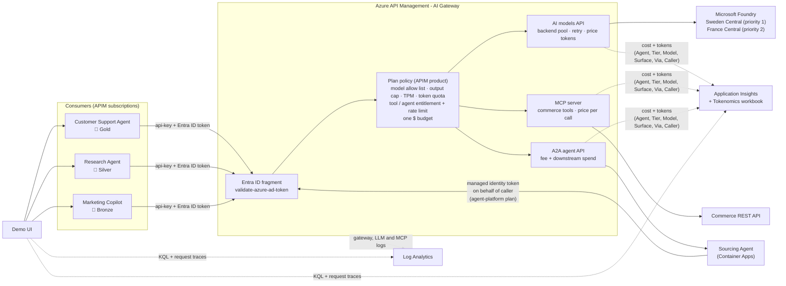

# APIM ❤️ Microsoft Foundry

## [AI Gateway Tokenomics lab](ai-gateway-tokenomics.ipynb)

[](ai-gateway-tokenomics.ipynb)

Customer-ready demo of Azure API Management as **one AI Gateway for the three AI surfaces**: **AI models** (Microsoft Foundry `gpt-4.1`, `gpt-4.1-mini`, `gpt-4.1-nano` and `DeepSeek-V3.2`), **MCP servers** (a REST API exposed as MCP tools) and **A2A agents** (a Sourcing Agent on Azure Container Apps). It shows the FinOps and product-management value of governing all three in one place:

- **One plan, one contract.** Each APIM **product** (Gold, Silver, Bronze) is a commercial plan. It bundles which models, MCP tools and A2A agents a consumer may use, their limits, and **one $ budget**.
- **Every call is priced.** Model calls by tokens, MCP tool calls per call, A2A tasks by a fee plus everything the agent spends downstream.
- **Spend follows the payer.** When an A2A agent calls models and tools for a caller, the gateway charges that spend back to the caller's budget and records the agent as `Via`.
- **One chargeback view.** Cost by consumer, plan, surface (model, tool, agent) and resource in Application Insights and an Azure Monitor workbook.
- **Zero trust and resilience, with evidence.** Every call needs a Microsoft Entra ID token as well as the key. Model calls are load balanced across two Foundry regions with a circuit breaker, and every policy decision can be traced and found in the Azure Monitor logs (see [Policies in action](#policies-in-action-entra-id-load-balancing-and-what-the-logs-track)).



### What each plan includes

Each **consumer** has its own APIM subscription, which gives it an identity and a key. Each consumer belongs to a **plan** (an APIM product). The [plan policy](product-policy.xml) applies the plan to every surface:

| Control | Surface | Policy | Result when exceeded |
|---|---|---|---|
| 🧭 **Model governance**: which models a plan can use | models | `choose` + `set-body` | premium models are **downgraded** to a cheaper model, or **denied** (403) |
| ✂️ **Output cap**: maximum `max_tokens` per call | models | `set-body` | the request is capped transparently |
| ⏱️ **Tokens per minute** | models | [`llm-token-limit`](https://learn.microsoft.com/azure/api-management/llm-token-limit-policy) | 429 + `Retry-After` |
| 📦 **Token quota** per day/month | models | [`llm-token-limit`](https://learn.microsoft.com/azure/api-management/llm-token-limit-policy) | 403 |
| 🧰 **Tool entitlement + calls per minute** | MCP | `choose` + [`rate-limit-by-key`](https://learn.microsoft.com/azure/api-management/rate-limit-by-key-policy) | 403 `tool-denied` (JSON-RPC error) / 429 |
| 🤝 **Agent entitlement + tasks per minute** | A2A | `choose` + [`rate-limit-by-key`](https://learn.microsoft.com/azure/api-management/rate-limit-by-key-policy) | 403 `agent-denied` / 429 |
| 💵 **One $ budget** for models, tools and agents | all | [`quota-by-key`](https://learn.microsoft.com/azure/api-management/quota-by-key-policy) incremented by each call's cost | 403 |

| Consumer | Plan | Models | Disallowed models | TPM | Token quota | Max output | MCP tools | A2A agents | $ budget |
|---|---|---|---|---|---|---|---|---|---|
| Customer Support Agent | 🥇 Gold | all four | n/a | 20,000 | 1M / month | 2,000 | all three, 60/min | Sourcing Agent, 10/min | $5.00 |
| Research Agent | 🥈 Silver | gpt-4.1-mini, gpt-4.1-nano, DeepSeek-V3.2 | downgraded to gpt-4.1-mini | 12,000 | 200K / month | 800 | `search-products`, `check-inventory`, 30/min | Sourcing Agent, 3/min | $0.01 |
| Marketing Copilot | 🥉 Bronze | gpt-4.1-nano | denied (403) | 1,500 | 20K / day | 300 | `search-products`, 10/min | none | $0.02 |

Demo price list (the `model-pricing`, `tool-pricing` and `agent-pricing` named values):

| Resource | Surface | Price |
|---|---|---|
| `search-products` | MCP tool | $0.0005 per call |
| `check-inventory` | MCP tool | $0.0002 per call |
| `get-supplier-quote` (premium data) | MCP tool | $0.0020 per call |
| `sourcing-agent` | A2A agent | $0.0050 per task + its downstream model and tool spend |
| Foundry models | AI model | per 1M input/output tokens, see the notebook |

### How it works

- **AI models**: the [models API policy](policy.xml) prices every call from the token usage and returns `x-gw-*` headers (served model, governance actions, tokens, cost, remaining tokens per minute).
- **MCP server**: APIM exposes the [commerce REST API](src/tools/openapi.json) as the `commerce-mcp` **MCP server**. Every MCP tool maps to an API operation, so the [MCP policy](src/tools/mcp-policy.xml) can price each `tools/call` and the plan policy can entitle and rate-limit each tool.
- **A2A agents**: APIM fronts the [Sourcing Agent](src/agent/agent.py) as an **A2A agent API**. Both the agent card and `message/send` tasks need a subscription key, so discovery is governed too, and tasks need a plan that includes the agent. The agent runs on Container Apps and only accepts calls that carry a gateway secret, so it can't be called around the gateway.
- **Chargeback**: the Sourcing Agent calls models and tools through APIM with its own `agent-platform` subscription and sends `x-gw-on-behalf-of: <caller>`. The [attribution fragment](attribution-fragment.xml) trusts that header only from the `agent-platform` plan, so the spend is drawn from the **caller's** $ budget and tagged `Via = sourcing-agent`. The [A2A policy](src/agent/a2a-policy.xml) adds the agent fee and returns the full bill (`x-gw-agent-fee-usd`, `x-gw-downstream-cost-usd`, `x-gw-cost-usd`, `x-gw-billed-to`).
- **Metrics**: every surface emits `CostMicroUSD` (plus `Prompt Tokens`, `Completion Tokens`, `Total Tokens` for models, and `GovernanceEvents`) to Application Insights with the `Agent`, `Tier`, `Model` (the model, tool or agent), `Surface` and `Via` dimensions.

> [!NOTE]
> The prices are **demo prices**. Check the [Azure OpenAI](https://azure.microsoft.com/pricing/details/cognitive-services/openai-service/) and Foundry Models pricing for current prices in your region. The Silver and Bronze budgets are deliberately tiny so you can exhaust them live: one Sourcing Agent task (about $0.009) nearly uses up Silver's $0.01. Every counter key includes the `budget-epoch` named value, so changing it resets all budgets and quotas: use the notebook reset step or the UI **Reset budgets** button before each demo.

In the Azure portal, open the APIM instance to see the gateway's own views of the three surfaces: **APIs → AI models**, **APIs → MCP servers** and **APIs → A2A agents** (preview), and **Products** for the plans.

### Policies in action: Entra ID, load balancing and what the logs track

The plan policies above decide *what a consumer may spend*. These policies decide *who may call* and *how the call is served*:

| Policy | Where | What it does | Evidence |
|---|---|---|---|
| 🔐 [`validate-azure-ad-token`](https://learn.microsoft.com/azure/api-management/validate-azure-ad-token-policy) | [entra-identity fragment](entra-identity-fragment.xml), included first by every plan | Every model, MCP and A2A call needs a Microsoft Entra ID token for `https://cognitiveservices.azure.com` from an approved client app (Azure CLI and the Sourcing Agent's managed identity), **on top of** the key. The key says *who pays*, the token says *who calls*. No token returns **401** before any tokens are spent. The token is removed before forwarding. | `x-gw-blocked-by: validate-azure-ad-token`, `x-gw-caller`. `ApiManagementGatewayLogs.LastErrorSource`. `Caller` dimension on the cost metrics. |
| 🪪 Managed identity end to end | Sourcing Agent → gateway → Foundry | The agent calls the gateway with its **user-assigned managed identity** token. The gateway calls Foundry with **its own** managed identity (`authentication-managed-identity`). There are no Foundry keys anywhere. | Trace: `authentication-managed-identity`. Caller `sourcing-agent (managed identity)`. |
| ⚖️ [Backend pool](https://learn.microsoft.com/azure/api-management/backends#load-balanced-pool) + [circuit breaker](https://learn.microsoft.com/azure/api-management/backends#circuit-breaker) | `inference-backend-pool`: `foundry1` (Sweden Central, priority 1) and `foundry2` (France Central, priority 2) | Priority routing with failover. A 429 from a region trips that backend's breaker for 1 minute (honouring `Retry-After`), so the next calls go straight to the other region. | `x-gw-route` (for example `foundry1 (Sweden Central) 429 > foundry2 (France Central) 200`), `x-gw-backend`. `BackendAttempts` metric. Gateway log `BackendUrl`. |
| 🔁 [`retry`](https://learn.microsoft.com/azure/api-management/retry-policy) | [models API policy](policy.xml), `<backend>` | Retries a 429/5xx call (up to twice) on the next available pool member, so the caller sees 200 instead of the regional throttle. | Trace: `retry`, `backend-pool` (`backend:foundry1 is inactive`). |
| 🧾 [`trace`](https://learn.microsoft.com/azure/api-management/trace-policy) + request tracing | all APIs | Writes the policy decisions (caller, failover) to the request trace, App Insights `traces` and gateway log `TraceRecords`. | The **Trace policies** toggle in the UI. |

> [!NOTE]
> To make failover easy to show, the lab deploys `gpt-4.1-nano` in Sweden Central with **capacity 1** (about 1K tokens per minute), so a short burst hits a real regional 429. While that backend's breaker is open, *every* model call is served from France Central for about a minute.

#### What each log tracks

| Where | Table / signal | What it tracks | Join key |
|---|---|---|---|
| Log Analytics | `ApiManagementGatewayLogs` | Every request: API, operation, product (plan), subscription, backend URL, status and backend status codes, timings, region, client IP, and **the policy that failed** (`LastErrorSource`, `LastErrorReason`, `LastErrorMessage`) | `CorrelationId` = `x-gw-request-id` |
| Log Analytics | `ApiManagementGatewayLlmLog` | Every AI model call: deployment, model, prompt/completion/total tokens counted by the gateway, streaming | `CorrelationId` |
| Log Analytics | `ApiManagementGatewayMCPLog` | Every MCP message: client, server, JSON-RPC method, tool name, session, authentication method and errors | `CorrelationId` |
| Application Insights | `requests`, `dependencies`, `traces` | Gateway requests and backend calls with end-to-end correlation, plus the `trace` policy records | `operation_Id` |
| Application Insights | `customMetrics` | `CostMicroUSD`, tokens, `GovernanceEvents` and `BackendAttempts`, with `Agent`, `Tier`, `Model`, `Surface`, `Via`, `Caller` (and `Backend`, `Region`, `Failover`) dimensions | dimensions |
| APIM request trace | `listTrace` (debug credentials) | The full policy-by-policy execution of one request: inbound, backend (pool choice, retry) and outbound | `apim-trace-id` |

Every gateway response returns `x-gw-request-id`, so any call in the UI can be looked up in Log Analytics. Diagnostic logs reach Log Analytics **2 to 5 minutes** after the call. To find the same evidence in the Azure portal:

- **APIM → APIs → (API) → Test** with **Trace** enabled shows the same policy-by-policy trace.
- **APIM → Logs** (or the Log Analytics workspace → Logs): run, for example, `ApiManagementGatewayLogs | where CorrelationId == "<x-gw-request-id>"`. Each table and query in the UI has an **Open in Log Analytics** link that opens it in the portal.
- **APIM → Backends** shows the pool, priorities and circuit breaker rules. **APIM → APIs → (API) → Policies** and **Policy fragments** show the deployed XML.
- The workbook's **Policies in action** section shows outcomes by policy, Entra ID rejections, backend attempts by region, tokens by deployment, MCP tool calls, failovers and cost by caller.

### Monitoring

- The **AI Gateway Tokenomics** Azure Monitor workbook, deployed with the lab, shows:
  - KPIs
  - cost by agent and surface, and cost by surface
  - the chargeback table: who pays for what, and via which agent
  - cost by model, tool and agent
  - cost over time
  - tokens by agent and model
  - budget vs spend
  - gateway outcomes (200/401/403/429) by agent
  - governance actions
  - **policies in action** (from Log Analytics and App Insights): outcomes by policy, Entra ID rejections, backend attempts by region over time, tokens by deployment, MCP tool calls, failovers, and cost by Entra ID caller
- All the data lives in **Application Insights** and **Log Analytics**:
  - `customMetrics` for tokens, cost, governance events and backend attempts
  - `requests` for the gateway outcomes, by subscription (agent) and product (plan)
  - `ApiManagementGatewayLogs`, `ApiManagementGatewayLlmLog` and `ApiManagementGatewayMCPLog` for the per-request policy evidence

### Demo UI

[src/app.py](src/app.py) is a lightweight web UI that uses only the Python standard library. With it you can:

- run **guided scenarios**: one-click stories that each send a small, fixed number of real calls through the gateway and explain what it did (see below)
- switch between the **AI models**, **MCP tools** and **A2A agents** surfaces, pick a consumer, and see what its plan allows
- send single requests or bursts, list or call MCP tools, read the agent card and send A2A tasks
- see what the gateway did for every call, including the agent's downstream steps and who paid for each
- send calls with or without an **Entra ID token**, and with **policy tracing** on
- open the **Policies & evidence** tab: the request pipeline, the backend pool, the deployed policy XML read back from Azure, a policy-by-policy trace of any traced call, its rows in the Log Analytics tables, and aggregate evidence queries with links to the portal
- compare plans in the **Plans & pricing** tab
- track each consumer's $ budget and its split by surface
- query the Application Insights chargeback live
- reset the budgets

Run it after step 3️⃣ of the notebook, which writes the git-ignored `src/demo-config.private.config`:

```bash
python src/app.py --port 8080
```

Then open http://localhost:8080. The UI gets the Entra ID tokens it sends, the Azure Monitor and Log Analytics queries, the request traces, the policy read-back and the **Reset budgets** button from your Azure CLI login. As a safety net, the UI server refuses more than 60 gateway calls per minute (set `DEMO_MAX_CALLS_PER_MINUTE` to change it).

### Guided scenarios

Click a scenario in the UI, or **Run the full demo** to play them all in order (about 57 calls, under $0.05 at the demo prices, about 7 minutes):

| # | Scenario | What the customer sees | Calls |
|---|----------|------------------------|-------|
| 1 | Same question, every model | Gold asks one question on each model. The gateway prices each call (about 24× between `gpt-4.1` and `gpt-4.1-nano`). | 4 |
| 2 | Model governance | Silver asks for `gpt-4.1` and is downgraded to `gpt-4.1-mini`. Bronze is denied with 403 and nothing reaches Foundry. | 2 |
| 3 | Output cap | Bronze asks for `max_tokens: 4000` and the gateway caps it at 300. | 1 |
| 4 | Tokens-per-minute limit | Bronze bursts long generations and gets 429 with Retry-After after 1,500 tokens per minute. | ≤ 10 |
| 5 | $ budget exhausted | Budgets are reset, then Silver runs long reports until its $0.01 budget is spent and gets 403. | ≤ 12 |
| 6 | MCP tools, priced and entitled per plan | Gold calls the premium `get-supplier-quote` tool and pays $0.002. Silver gets 403 `tool-denied` for the same tool and $0.0005 for `search-products`. | 5 |
| 7 | A2A agent task cost | Gold sends a task to the Sourcing Agent. The bill is the agent fee plus every model and tool step, all charged to Gold. Bronze gets 403 `agent-denied`. | 2 |
| 8 | One $ budget across models, tools and agents | Budgets are reset, then Silver mixes a model call, a tool call and an agent task until the shared $0.01 budget returns 403. | ≤ 6 |
| 9 | Chargeback in Azure Monitor | Opens the App Insights view: cost per consumer, plan, surface and resource, including spend made via the agent. | 0 |
| 10 | Zero trust: Microsoft Entra ID | A model call and an MCP call with the key but **no token** get 401 from `validate-azure-ad-token`. The same call with a token returns 200, and `x-gw-caller` shows who called. | 3 |
| 11 | Load balancing & regional failover | Gold bursts `gpt-4.1-nano`. Sweden Central returns 429, the gateway retries in France Central (`x-gw-route`), and the circuit breaker keeps sending calls to France. | 8 |
| 12 | Policy trace & Azure Monitor evidence | A traced Silver call is downgraded. The UI shows the policy-by-policy trace, then the call's rows in the gateway and LLM log tables, the deployed policy XML and the aggregate evidence, each with a portal link. | 1 |

### Suggested demo script (manual)

1. **Reset budgets** in the UI.
2. **AI models**: select **Customer Support Agent** (Gold) and send to `gpt-4.1`, then `DeepSeek-V3.2`. Point out the served model, tokens and cost of each call. Switch to **Research Agent** (Silver) and send to `gpt-4.1`: the gateway downgrades it to `gpt-4.1-mini`.
3. **MCP tools**: select Gold, call `get-supplier-quote` ($0.002). Switch to Silver and call the same tool: 403 `tool-denied`, because the tool is not in the Silver plan.
4. **A2A agents**: select Gold, read the agent card, then send a sourcing task. Walk through the steps table: every model and tool call the agent made is billed to Gold, with the agent fee on top. Switch to Bronze: 403 `agent-denied`.
5. Select **Research Agent** (Silver) and send one Sourcing Agent task, then a model call: the shared $0.01 budget is exhausted and the gateway returns 403 on every surface.
6. Open **Plans & pricing** to show that each plan is one APIM product, then the **Azure Monitor** tab or the **Workbook** to show the chargeback by consumer, plan and surface.
7. **Policies & evidence**: untick **Send Entra ID token** and send one call to show the 401, then tick it again. Tick **Trace policies**, send a Silver `gpt-4.1` call and click its **Evidence** link to show the trace and, a few minutes later, its Log Analytics rows. Click **Open in Log Analytics** to show the same rows in the Azure portal.

### Prerequisites

- [Python 3.12 or later version](https://www.python.org/) installed
- [VS Code](https://code.visualstudio.com/) installed with the [Jupyter notebook extension](https://marketplace.visualstudio.com/items?itemName=ms-toolsai.jupyter) enabled
- [uv](https://docs.astral.sh/uv/): run `uv sync` from the repo root to install dependencies
- [An Azure Subscription](https://azure.microsoft.com/free/) with [Contributor](https://learn.microsoft.com/en-us/azure/role-based-access-control/built-in-roles/privileged#contributor) + [RBAC Administrator](https://learn.microsoft.com/en-us/azure/role-based-access-control/built-in-roles/privileged#role-based-access-control-administrator) or [Owner](https://learn.microsoft.com/en-us/azure/role-based-access-control/built-in-roles/privileged#owner) roles
- [Azure CLI](https://learn.microsoft.com/cli/azure/install-azure-cli) installed and [Signed into your Azure subscription](https://learn.microsoft.com/cli/azure/authenticate-azure-cli-interactively)

### 🚀 Get started

Proceed by opening the [Jupyter notebook](ai-gateway-tokenomics.ipynb), and follow the steps provided.

### 🗑️ Clean up resources

When you're finished with the lab, you should remove all your deployed resources from Azure to avoid extra charges and keep your Azure subscription uncluttered.
Use the [clean-up-resources notebook](clean-up-resources.ipynb) for that.
