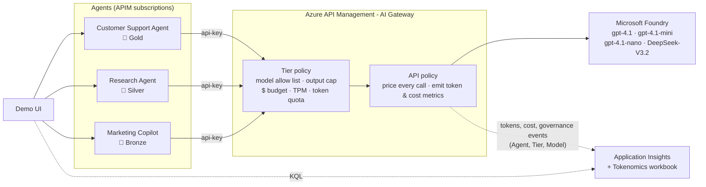

# APIM ❤️ Microsoft Foundry

## [AI Gateway Tokenomics lab](ai-gateway-tokenomics.ipynb)

[](ai-gateway-tokenomics.ipynb)

Customer-ready demo of how Azure API Management, acting as an **AI Gateway**, governs the **cost and token consumption** of many agents that share a catalog of Microsoft Foundry models (`gpt-4.1`, `gpt-4.1-mini`, `gpt-4.1-nano` and `DeepSeek-V3.2`).



### What the gateway enforces

Each **agent** has its own APIM subscription, which gives it an identity and a key. Each agent belongs to a **tier** (an APIM product), and the [tier policy](product-policy.xml) enforces:

| Control | Policy | Result when exceeded |
|---|---|---|
| 🧭 **Model governance**: which models a tier can use | `choose` + `set-body` | premium models are **downgraded** to a cheaper model, or **denied** (403) |
| ✂️ **Output cap**: maximum `max_tokens` per call | `set-body` | the request is capped transparently |
| ⏱️ **Tokens per minute** | [`llm-token-limit`](https://learn.microsoft.com/azure/api-management/llm-token-limit-policy) | 429 + `Retry-After` |
| 📦 **Token quota** per day/month | [`llm-token-limit`](https://learn.microsoft.com/azure/api-management/llm-token-limit-policy) | 403 |
| 💵 **$ budget**: every call is priced by the gateway | [`quota-by-key`](https://learn.microsoft.com/azure/api-management/quota-by-key-policy) incremented by the call's cost | 403 |

The [API policy](policy.xml) prices every call using the `model-pricing` named value (USD per 1M input/output tokens). It returns the result to the caller in `x-gw-*` headers: served model, governance actions, tokens, cost and remaining tokens per minute. It also emits the `Prompt Tokens`, `Completion Tokens`, `Total Tokens`, `CostMicroUSD` and `GovernanceEvents` custom metrics to Application Insights, with the `Agent`, `Tier` and `Model` dimensions.

| Agent | Tier | Models | Disallowed models | TPM | Token quota | Max output | $ budget |
|---|---|---|---|---|---|---|---|
| Customer Support Agent | 🥇 Gold | all four | n/a | 20,000 | 1M / month | 2,000 | $5.00 |
| Research Agent | 🥈 Silver | gpt-4.1-mini, gpt-4.1-nano, DeepSeek-V3.2 | downgraded to gpt-4.1-mini | 12,000 | 200K / month | 800 | $0.01 |
| Marketing Copilot | 🥉 Bronze | gpt-4.1-nano | denied (403) | 1,500 | 20K / day | 300 | $0.02 |

> [!NOTE]
> The prices in the notebook are **demo prices**. Check the [Azure OpenAI](https://azure.microsoft.com/pricing/details/cognitive-services/openai-service/) and Foundry Models pricing for current prices in your region. The Silver and Bronze budgets are deliberately tiny so you can exhaust them live. Every counter key includes the `budget-epoch` named value, so changing it resets all budgets and quotas: use the notebook reset step or the UI **Reset budgets** button before each demo.

### Monitoring

- The **AI Gateway Tokenomics** Azure Monitor workbook, deployed with the lab, shows:
  - KPIs
  - cost by agent and by model
  - cost over time
  - tokens by agent and model
  - budget vs spend
  - gateway outcomes (200/403/429) by agent
  - governance actions
- All the data lives in **Application Insights**:
  - `customMetrics` for tokens, cost and governance events
  - `requests` for the gateway outcomes, by subscription (agent) and product (tier)

### Demo UI

[src/app.py](src/app.py) is a lightweight web UI that uses only the Python standard library. With it you can:

- pick an agent and a model, which shows the tier limits and whether each model is allowed, downgraded or denied
- send single requests, bursts or mixed traffic
- see what the gateway did for every call
- track each agent's $ budget
- query the Application Insights breakdown live
- reset the budgets

Run it after step 3️⃣ of the notebook, which writes the git-ignored `src/demo-config.private.config`:

```bash
python src/app.py --port 8080
```

Then open http://localhost:8080. The **Azure Monitor** tab and the **Reset budgets** button use your Azure CLI login.

### Suggested demo script

1. **Reset budgets** in the UI.
2. Select **Customer Support Agent** (Gold) and send to `gpt-4.1`, then `DeepSeek-V3.2`. Point out the served model, tokens and cost of each call.
3. Select **Research Agent** (Silver) and send to `gpt-4.1`. The gateway downgrades the call to `gpt-4.1-mini`.
4. Select **Marketing Copilot** (Bronze) and send to `gpt-4.1`. The call is denied with 403. Then **Burst ×10** on `gpt-4.1-nano` with the long prompt: 429s appear once the agent passes 1,500 tokens per minute.
5. Select **Research Agent** and burst the *Long generation* prompt. The $0.01 budget is exhausted and the gateway returns 403.
6. **Simulate mixed traffic** for a minute. Then open the **Azure Monitor** tab or the **Workbook** to show the breakdown by agent, tier and model.

### Prerequisites

- [Python 3.12 or later version](https://www.python.org/) installed
- [VS Code](https://code.visualstudio.com/) installed with the [Jupyter notebook extension](https://marketplace.visualstudio.com/items?itemName=ms-toolsai.jupyter) enabled
- [uv](https://docs.astral.sh/uv/): run `uv sync` from the repo root to install dependencies
- [An Azure Subscription](https://azure.microsoft.com/free/) with [Contributor](https://learn.microsoft.com/en-us/azure/role-based-access-control/built-in-roles/privileged#contributor) + [RBAC Administrator](https://learn.microsoft.com/en-us/azure/role-based-access-control/built-in-roles/privileged#role-based-access-control-administrator) or [Owner](https://learn.microsoft.com/en-us/azure/role-based-access-control/built-in-roles/privileged#owner) roles
- [Azure CLI](https://learn.microsoft.com/cli/azure/install-azure-cli) installed and [Signed into your Azure subscription](https://learn.microsoft.com/cli/azure/authenticate-azure-cli-interactively)

### 🚀 Get started

Proceed by opening the [Jupyter notebook](ai-gateway-tokenomics.ipynb), and follow the steps provided.

### 🗑️ Clean up resources

When you're finished with the lab, you should remove all your deployed resources from Azure to avoid extra charges and keep your Azure subscription uncluttered.
Use the [clean-up-resources notebook](clean-up-resources.ipynb) for that.
